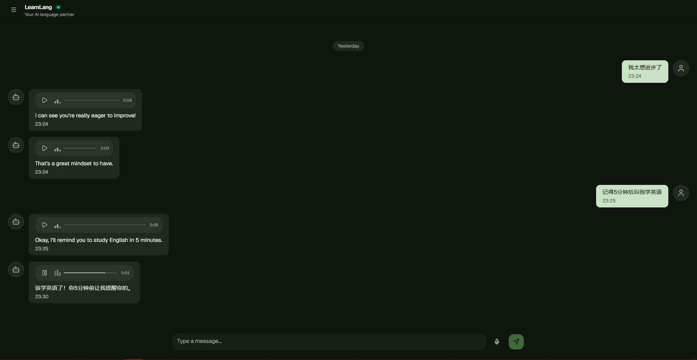
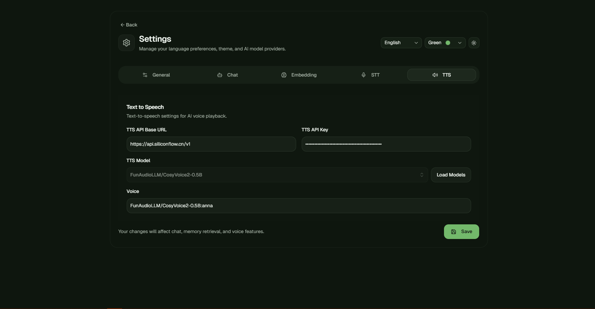

# LearnLang

<div align="center">

English | [中文](README_CN.md)

</div>

LearnLang is an AI chat application designed for language learning. It supports text and voice input, real-time responses via WebSocket, long-term memory retrieval, and scheduled messaging.

It is not just an AI assistant, but a **language learning companion with memory capabilities**.

---

## Features

- Text chat and voice chat
- AI bilingual responses (each sentence includes a translation)
- Real-time streaming responses based on WebSocket
- Long-term memory storage and semantic retrieval powered by `pgvector`
- Conversation summarization and context compression
- Scheduled messages / reminders (automatically converted to UTC)
- Text-to-Speech (TTS) and Speech-to-Text (STT)
- OpenAI-compatible API with multi-model support
- One-click deployment with Docker

<p align="center">
  
</p>

---

## Quick Start

### Run with Docker

Clone the repository

```bash
git clone https://github.com/your-repo/learnlang.git
cd learnlang
```

Copy environment configuration

```bash
cd docker
cp .env.example .env
```

After modifying `api.config.yaml` and `.env`, start all services with Docker Compose

```bash
docker compose -f docker-compose.yml up -d
```

---

### Build Local Images

Copy environment configuration

```bash
cd docker
cp .env.example .env
```

After modifying `api.config.yaml` and `.env`, build and run locally

```bash
docker compose -f docker-compose.local.yml build
docker compose -f docker-compose.local.yml up -d
```

---

### Run from Source

Copy environment configuration

```bash
cd docker
cp .env.example .env
```

After modifying `api.config.yaml` and `.env`, start dependencies

```bash
docker compose -f docker-compose.dev.yml up -d
```

Start backend service

```bash
cd api
go mod tidy
go run main.go
```

Start frontend app

```bash
cd app
pnpm install
pnpm run dev
```
Run desktop app

```bash
pnpm tauri dev
```

### Configure Models

Before use, you need to configure four types of models: chat, embeddings, speech-to-text, and text-to-speech.

<p align="center">
  
</p>