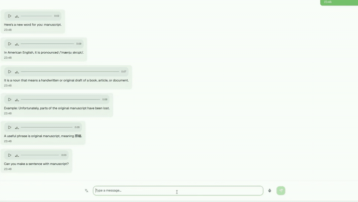
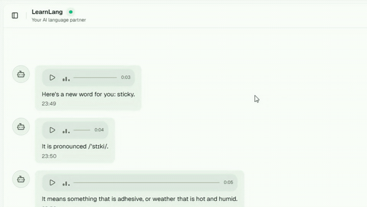
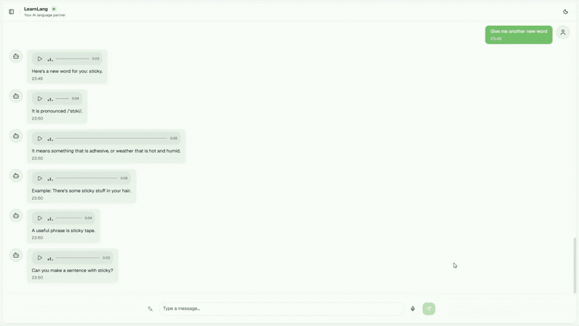

# LearnLang

<div align="center">

**An AI language-learning companion for conversations that become vocabulary and memory.**

[中文](README_CN.md)

</div>

LearnLang is a language-learning chat application built around practical conversation. Use text or voice to practice, read bilingual AI replies, collect vocabulary from real messages, and let long-term memory keep your learning context available over time.

## Product Tour

<p align="center">
  
</p>

### Translate directly in chat

Not sure how to express it? Translate first, then send it to AI.

<p align="center">
  
</p>

### Reveal a translation from the AI avatar

Click an assistant avatar to switch that reply between the target-language sentence and its translation.

<p align="center">
  
</p>

### Look up vocabulary from a message

Select a word or phrase from a chat message to look it up in your vocabulary library while it is still in context.

<p align="center">
  
</p>

### A conversation that compounds

Each assistant response can include a translation and optional speech. Recent messages remain available as conversation context; older conversations can be summarized and indexed for semantic retrieval. Learners can look up vocabulary that appears in a message, add it to a library, and continue practicing without leaving the conversation.

### Bring your own model setup

LearnLang supports OpenAI-compatible services for chat, embeddings, speech-to-text, and text-to-speech. Configure providers and models in Settings, then tailor the learning experience to your target language, native language, and time zone.

## Vocabulary Source

LearnLang supports personal vocabulary libraries and JSON imports. A useful upstream source for English word lists is [KyleBing/english-vocabulary](https://github.com/KyleBing/english-vocabulary), which provides level-based English vocabulary data such as CET-4, CET-6, postgraduate, and SAT lists.

1. Choose a list appropriate to the learner's level from the upstream project.
2. Convert or map the list into LearnLang's import format. See `demo_vocabulary.json` and `demo_vocabulary_learnlang.json` for local examples.
3. Create or select a vocabulary library, then use **Import** in the app.

The upstream vocabulary project retains ownership of its content and license. Review its terms before redistributing a derived library.

## Quick Start

### Prerequisites

- Docker Engine with Docker Compose v2 for containerized deployment
- Go and pnpm when running from source
- Rust and Cargo for the Tauri desktop client
- AI provider credentials for chat, embeddings, speech-to-text, and text-to-speech

### Run with Docker

```bash
git clone https://github.com/CoolCoolTomato/LearnLang.git
cd LearnLang/docker
cp .env.example .env
```

Configure your database password and public API URL in `.env`, then review `api.config.yaml` for database, Redis, Milvus, and server settings.

```bash
docker compose -f docker-compose.yml up -d
docker compose -f docker-compose.yml ps
```

This starts PostgreSQL, Redis, Milvus, MinIO, the API, the background worker, and the web app.

### Build Images Locally

```bash
cd docker
cp .env.example .env
docker compose -f docker-compose.local.yml build
docker compose -f docker-compose.local.yml up -d
```

### Run from Source

Start local dependencies first:

```bash
cd docker
cp .env.example .env
docker compose -f docker-compose.dev.yml up -d
```

Then run the API and web app in separate terminals:

```bash
cd api
go run main.go
```

```bash
cd app
pnpm install
pnpm run dev
```

To run the desktop client:

```bash
cd app
pnpm tauri dev
```

## First Configuration

1. Open Settings after signing in.
2. Set your native language, target language, and time zone.
3. Configure providers and models for chat, embeddings, STT, and TTS.
4. Open Chat, send a message, and import or collect vocabulary as you learn.

Keep keys in local `.env` and configuration files only. Do not commit API keys, passwords, or storage credentials.

## Architecture

```text
Web app / Tauri desktop app
             |
           Go API ---- Redis (sessions, notifications, scheduled work)
             |  \
             |   \--- PostgreSQL (users, messages, vocabulary)
             |
             +------ Milvus (semantic conversation memory)
             +------ MinIO (voice assets)
             +------ AI providers (chat, embedding, STT, TTS)
```

The API persists messages and vocabulary, coordinates Agent responses, and broadcasts assistant replies through WebSocket. Background work handles scheduled messages and conversation archiving.

## Development

```bash
cd api && go test ./... && go build ./...
cd app && pnpm run lint && pnpm run build
```

Repository layout:

- `api/`: Go API, Agent runtime, persistence, and background work
- `app/`: React web and Tauri desktop client
- `docker/`: Compose files and local service configuration
- `assets/`: README media and project assets

## Acknowledgements

- English vocabulary lists can be sourced from [english-vocabulary](https://github.com/KyleBing/english-vocabulary).
